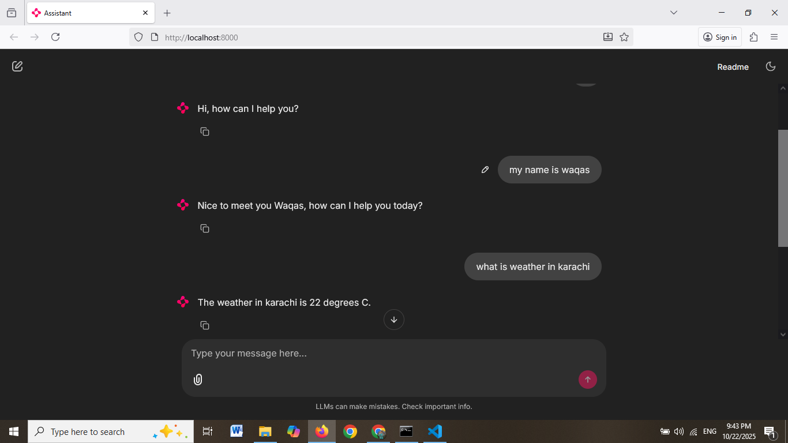

# 🤖 Chainlit AI Chatbot using OpenAI Agents SDK & Google Gemini

## 📝 Description
This project is an **interactive AI chatbot** built using **Chainlit** and the **OpenAI Agents SDK**, powered by **Google Gemini** models.  
It supports **real-time streaming responses**, **custom tools (e.g., calculator)**, and **automatically saves chat history** as JSON in a `runs/` folder.  
The chatbot features a **fully customized UI** with themes, logos, and templates for different chat modes (greeting, math demo, etc.).

---

## 🧱 Project Structure

chatbot-3/
├─ pyproject.toml
├─ README.md
├─ .gitignore
├─ .env.example
├─ runs/
├─ src/
│  ├─ agent/
│  └─ chat_ui/
└─ scripts/

---

## ⚙️ Setup Instructions
# Running locally

1. `cp .env.example .env` and set `GEMINI_API_KEY`.
2. Start with: `uv run chatbot`
3. Open the Chainlit UI at `http://localhost:8000` (or the address printed by Chainlit).

